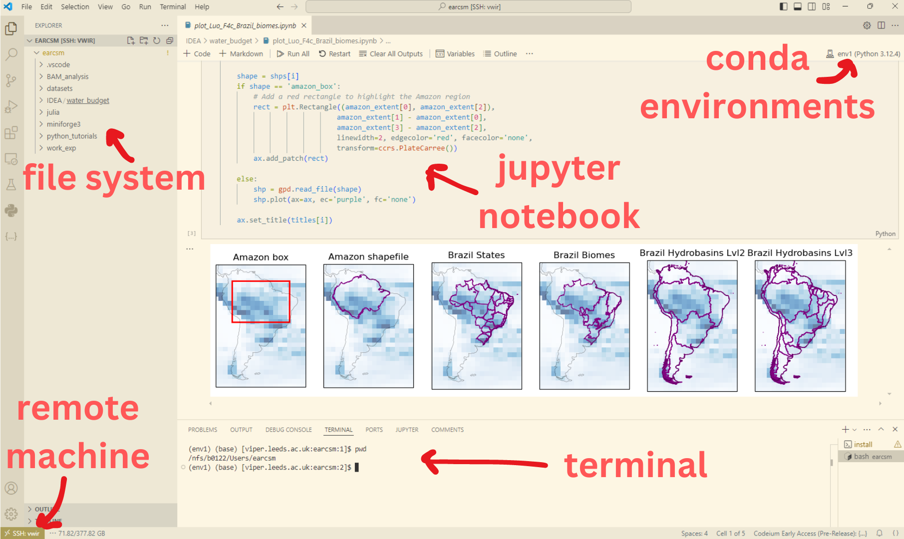

_author: Callum_

## Using VSCode 
In this tutorial you will learn **what** VSCode is, **why** you might want to use it and **how** you can go about using it both **locally** and **remotely**.
This is intended as a starting point, from which there are many better resources for advancing your use. 

For context, the image below shows an example workspace, highlighting some of the main features of VSCode which make it great.

### **What** is VSCode and **why** would you use it?
- Its a powerful and open source integrated development environment with a graphical user interface (IDE GUI if you will...)
- You can write, edit and run code interactively in several common languages (Python, R, Julia, C...)
- You can easily access and run code on remote machines (with zero lag), without the need for NoMachine or x2go
- You can graphically view local and remote file systems, outputs (plots etc) and files (csv, netcdf, tiff...)
- You can run code interactively using python scripts or Jupyter Notebooks
- Access to thousands of open source 'Extensions' which make coding life better!
- Seamless source control integration with Git and GitHub
- It is commonly used in industry in favour of language specific IDEs such as Spyder or RStudio
- If you have used Jupyter Notebooks, Spyder or RStudio before, it will be VERY easy to pick up
- VSCode is very well documented and there are lots of good tutorials (eg. https://code.visualstudio.com/docs/getstarted/getting-started)
  
### Now you're convinced, **how** can I get and run VSCode locally?
0. requirements: for python you'll need conda or similar installed (but you probs have this already), also it isn't necessary (you can use powershell or command prompt), but it is helpful to download WSL (windows subsystem for linux) as this will give you easier access to command line features on windows (as a replacement for MobaXterm or similar).
I will focus on Python here, but the process is similar for R (might add this at a later date)
   
2. Download/ load 'Visual Studio Code' from AppsAnywhere on windows or from website for mac
3. Once open, you reach the welcome screen with customisation options (you can easily change this again later) and short tutorials
4. From this point you can use the file explorer and terminal functions, but to run scripts etc you will need **extensions**
5. Extensions are easily installed and allow you to run Python, Jupyter and much more
6. To install an extension, click the extensions tab on the left of the window from which you can view popular extensions
7. You'll want to install **Python** and **Jupyter** but to access remote machines such as foe-xx, viper, ARC etc you'll need '**Remote - SSH**' as well
8. From this point, assuming you have anaconda (or similar) installed, you will be able to create a new python file, save it in any local directory and run the file in the terminal choosing your exisiting or new conda environment, or interactively (like you can in Spyder etc). If you get stuck here the walkthroughs on the Welcome page are actually quite helpful

### Developing on Remote Servers
- Using the installed 'Remote - SSH' extension, accessible on the left of the window (called Remote Explorer), you can add your remote server pathways, and simply navigate to them with the click of a button.
- In exactly the same way you would navigate to foe machines via the command line using your configured ssh/config file (see how to configure this file here: https://bjsilver.github.io/bag_wiki/docs/remote_access/SSH_configs.html), you can write a config file specifically in VSCode.
- To access this file, you can use the command palatte (basically a search function in VSCode which does almost everything), Ctrl + Shift + P on window to access, and search for 'Remote - SSH', you will see open configuration file.
- You can copy your exisiting config file into here and utilise all of your exisitng shortcuts and log in methods
- Now, when refreshed, you can view all of your remote servers and connect to them by pressing the arrow button next to them ('Connect in current window')
- Depending on your configuration you may need to type your password and or confirm via Duo (this can be streamlined with SSH keys, or when using a wired ethernet connection in university).
- You can now code remotely, access and view files and plots seamlessly, congrats!
- To end the session (important), use the command palette and see or search for Remote - SSH: close remote connection

### Tips
- Sometimes it takes a while to find and connect to a remote machine and vscode will decide to timeout. To avoid this, you in 'Remote - SSH: Settings', increase the 'Connect Timeout' value. I set mine to 1080 which is plenty.
- Setting up SSH keys is strongly advised as this will reduce the number of times you will need to enter your password. A tutorial on setting up keys is here  [SSH Keys](https://bjsilver.github.io/bag_wiki/docs/remote_access/SSH_key_pairs.html).
- When on campus, connect your laptop to the ethernet, this will give a further smoother connection, and will allow you to access remote machines without entering passwords.

